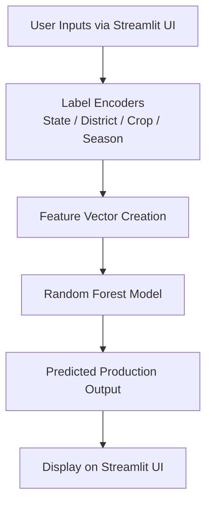

# 🌾 Crop Production Prediction Web App

This project is a **Machine Learning + Streamlit-based** web app that predicts **crop production (in metric tons)** using historical agricultural data. The app allows users to select a **state, district, crop, and season**, enter **area and year**, and get an intelligent production estimate powered by a trained Random Forest model.

## 🚀 Live Demo

🔗 [Live App (Streamlit)](https://share.streamlit.io/your-repo-url) *(Add your link here once deployed)*

## 📦 Tech Stack

- **Frontend/UI**: [Streamlit](https://streamlit.io/)
- **Backend/ML**: Python, Scikit-Learn (Random Forest Regressor)
- **Data**: `crop_production_dataset.csv` (preprocessed)
- **Serialization**: Pickle for model and label encoders

## 📁 Project Structure

```bash
├── crop new.ipynb              # Jupyter Notebook for EDA, preprocessing, training
├── crop_production_dataset.csv # Raw dataset
├── crop_production_filtered.csv# Cleaned dataset (used in app)
├── rf_model.pkl                # Trained Random Forest model
├── label_encoders.pkl          # Label encoders for categorical features
├── outputrun.py                # Streamlit app script
└── README.md                   # Project documentation
```

## 🧠 Features

- Dynamic dropdowns for **state → district** mapping
- Label encoding for categorical data
- Real-time prediction using trained Random Forest model
- Error handling for user input

## 📊 Model Details

- Algorithm: Random Forest Regressor
- Evaluation: Mean Absolute Error / RMSE (check notebook)
- Features used:
  - State
  - District
  - Crop
  - Season
  - Area (in hectares)
  - Year

## 🧰 How to Run Locally

```bash
# Clone the repository
git clone https://github.com/your-username/crop-prediction-app.git
cd crop-prediction-app

# Install dependencies
pip install -r requirements.txt

# Make sure these files are in the same directory:
# - rf_model.pkl
# - label_encoders.pkl
# - crop_production_filtered.csv

# Run the app
streamlit run outputrun.py
```

## 🧭 Architecture (Mermaid Diagram)



## 📝 References

- [Streamlit Docs](https://docs.streamlit.io/)
- [Scikit-Learn Random Forest](https://scikit-learn.org/stable/modules/generated/sklearn.ensemble.RandomForestRegressor.html)
- [Crop Data Source (India Govt)](https://data.gov.in/catalog/agricultural-statistics)

## 🤝 Contributors

- Deepanshu Khanna (Developer, ML Engineer)

## 📜 License

This project is licensed under the MIT License. See `LICENSE` for details.
